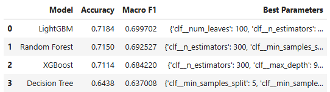

# Credit Score Prediction : End-To-End Machine Learning Deployment

🔗 **Live Dashboard:** [credit-score-prediction-tokesi-8.streamlit.app](https://credit-score-prediction-tokesi-8.streamlit.app/)

- Credit Score Classifier is an end-to-end Machine Learning project that classifies customers into three credit score categories: Poor, Standard, and Good.
- The project starts with EDA and model experimentation in a Jupyter Notebook, followed by the development of a reproducible end-to-end ML pipeline, local inference through Streamlit, and cloud deployment using AWS SageMaker and EC2.
- The final system separates the ML inference service from the user interface, with SageMaker serving the model and EC2 hosting the Streamlit application.


## Development Stages

| Stage                 | Description                                                     |
| --------------------- | --------------------------------------------------------------- |
| **EDA & Modeling**    | Explore, clean, transform, and analyze the dataset.             |
| **Model Selection**   | Compare and select the top 3 models based on Macro F1-Score.    |
| **Local Pipeline**    | Build a reproducible end-to-end ML pipeline.                    |
| **Local Inference**   | Integrate the trained model with Streamlit for prediction.      |
| **Cloud Deployment**  | Deploy the selected model through AWS SageMaker.                |
| **Cloud Application** | Host Streamlit on EC2 and connect it to the SageMaker endpoint. |

## Background Problem
- Financial institutions need to assess the credit performance of their customers efficiently and consistently.
- Manual credit assessment can be time-consuming, especially when dealing with a large number of customers. This project applies a data-driven classification approach to automatically assess customer credit profiles based on their financial, credit, and payment behavior.

- The prediction target, Credit_Score, consists of three classes:
  - Poor
  - Standard
  - Good
    
- Because the target classes are not perfectly balanced, Macro F1-Score is used as the primary evaluation metric to measure performance across all classes more evenly.

## Dataset

The dataset contains **24,998 customer records** with **21 features** covering demographic, financial, credit, loan, and payment information.
* **Target:** `Credit_Score`
* **Classes:** Poor, Standard, Good
* **Data split:** 80% training, 20% testing
  

## Preprocessing

All preprocessing steps are fitted on the training set only to prevent data leakage.

- **Data Cleaning:** Convert numeric columns stored as objects, replace placeholder values with `Unknown`, and handle negative values using absolute values.
- **Feature Engineering:** Create `Num_Type_of_Loan` and `Credit_History_Age_Months` from the original features.
- **Outlier Handling:** Apply IQR clipping, cap `Interest_Rate` at the 99th percentile, and remove corrupted `Monthly_Balance` records.
- **Feature Transformation:** Apply `RobustScaler` to numerical features, `OrdinalEncoder` to ordinal features, and `OneHotEncoder` to categorical features using a `ColumnTransformer`.


## Insights

- **LightGBM** achieved the best performance, with **71.84%** Accuracy and **69.97%** Macro F1-Score, making it the selected model for deployment.
- **LightGBM** performed best on the Standard class with an F1-Score of 0.75, followed by Poor (0.72) and Good (0.63).
### From Notebook to Production

**1. Local end-to-end pipeline**

After the models were trained and saved as `.pkl` files, the whole process was rebuilt as an **OOP end-to-end pipeline** that runs locally first. Each step is a separate class (`DataIngestion`, `DataPreprocessing`, `ModelTrainer`, `ModelEvaluator`) and all of them are orchestrated by `pipeline.py` (`CreditScorePipeline`), which runs ingestion, preprocessing, training, evaluation, and model comparison in one execution. Preprocessing and the model are saved together as one scikit-learn pipeline, and every run is tracked with MLflow.

**2. Local application**

Once the orchestration code was in place, `app_streamlit.py` was created as the user interface. It loads the saved `.pkl` model, takes the customer's financial profile as input, and returns the predicted credit score with its class probabilities.

**3. Cloud deployment**

For the cloud version, the end-to-end pipeline was adapted in a **SageMaker notebook**, and the trained model was deployed as a **SageMaker endpoint**. The `app_streamlit.py` file is then deployed on **EC2**, so predictions are no longer made locally: Streamlit sends the input to the deployed SageMaker endpoint and displays the result. This keeps the model service and the user interface separate.

## Repository Structure

```text
Credit-Score-Classifier/
│
├── AWS/
│   ├── app_streamlit.py                       # Streamlit application for AWS deployment
│   ├── data_ingestion.py                      # Load and prepare input data
│   ├── evaluation.py                          # Evaluate model performance
│   ├── inference.py                           # Handle model inference
│   ├── mlflow.db                              # MLflow tracking database
│   ├── preprocessing.py                       # Data preprocessing and feature engineering
│   ├── requirements.txt                       # AWS environment dependencies
│   ├── training.py                            # Model training
│   └── user-data.sh                           # EC2 instance initialization script
│
├── Local/
│   ├── models/                                # Trained model files
│   ├── app_streamlit.py                       # Local Streamlit application
│   ├── data_A.csv                             # Dataset
│   ├── data_ingestion.py                      # Load and prepare dataset
│   ├── evaluation.py                          # Evaluate model performance
│   ├── inference.py                           # Generate predictions
│   ├── pipeline.py                            # Run the end-to-end ML pipeline
│   ├── preprocessing.py                       # Data preprocessing and feature engineering
│   └── training.py                            # Model training
│
├── Notebook/
│   └── Data_Exploration_and_Modelling.ipynb    # EDA, model comparison, and tuning
├── images/                                     # README and project screenshots
│  
├── README.md                                   # Project documentation
└── requirements.txt                            # Project dependencies
```

# Tech Stack

Python · pandas · NumPy · scikit-learn · LightGBM · XGBoost · Random Forest · MLflow · Streamlit · AWS SageMaker · AWS EC2 · Amazon S3 · CloudWatch

